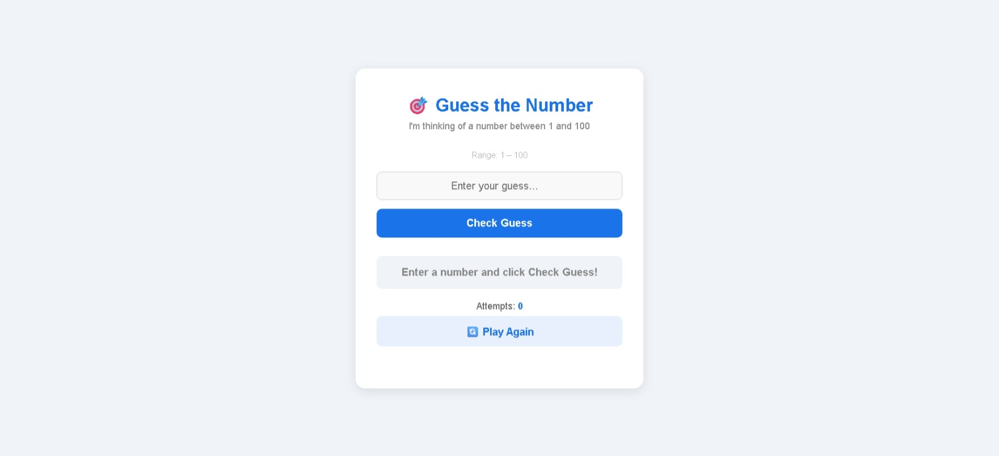
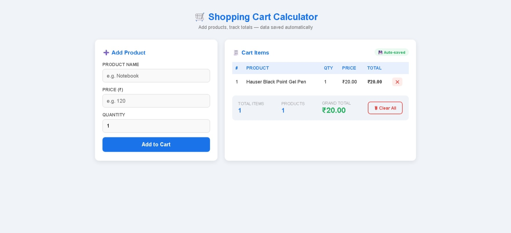
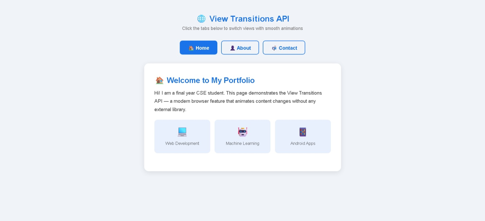
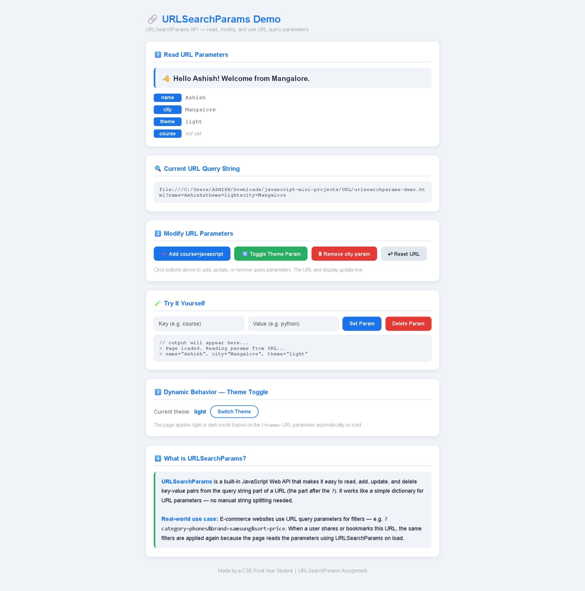

# <a href="#"></a>

---

<div align="center">

### 🎓 LetsUpgrade JavaScript Bootcamp Program
**Master Core JavaScript Concepts Through Interactive Projects**


</div>

---

## 📋 Project Overview

This repository contains **4 interactive JavaScript mini-projects** completed as part of the **LetsUpgrade Bootcamp Program**. Each project demonstrates core JavaScript concepts through hands-on, real-world applications with live interactive demos.

### ✨ What You'll Learn
- ✅ DOM Manipulation & Event Handling
- ✅ Array Methods & Iteration
- ✅ LocalStorage & Data Persistence
- ✅ Modern Browser APIs (View Transitions, URLSearchParams)
- ✅ Responsive UI Design
- ✅ Error Handling & Validation
- ✅ Real-time User Feedback

---

## 🚀 Featured Projects

### 📊 Project 1: Guess the Number Game
**Bootcamp Assignment:** Make an Interactive Guess the Number Game

<div align="center">


**[🎮 Play Live Demo](https://guess-the-number-game-lake.vercel.app/)**

</div>

An interactive number guessing game where the computer generates a random number (1-100) and you try to guess it. Get real-time feedback with "Too High" or "Too Low", track your attempts, and see your previous guesses.

**Key Concepts:**
| Concept | Purpose |
|---------|---------|
| `Math.random()` & `Math.floor()` | Generate random numbers |
| `parseInt()` | Convert string inputs to integers |
| `if/else if/else` | Conditional logic for comparisons |
| `DOM manipulation` | Update page content dynamically |
| `Event listeners` | Respond to user actions |
| `Array + forEach` | Store and display guess history |

**Tech Stack:**
- Vanilla HTML5, CSS3, JavaScript (ES6+)
- Dynamic DOM manipulation
- Event-driven architecture

**Screenshot:**


---

### 🛒 Project 2: Shopping Cart Calculator
**Bootcamp Assignment:** Shopping Cart Calculator Essentials: Local Storage & Responsive UI

<div align="center">


**[🛍️ Try Live Demo](https://shopping-cart-calculator-two.vercel.app/)**

</div>

A fully functional shopping cart where you can add products with custom names, prices, and quantities. Features automatic duplicate detection, persistent storage with localStorage, and real-time calculations.

**Key Concepts:**
| Concept | Purpose |
|---------|---------|
| `localStorage.setItem()` & `getItem()` | Persist data across sessions |
| `JSON.stringify()` & `JSON.parse()` | Serialize/deserialize data |
| `Array.reduce()` | Calculate totals efficiently |
| `parseFloat()` & `parseInt()` | Parse numeric inputs |
| `DOM table manipulation` | Render dynamic table rows |
| `Duplicate detection` | Smart cart management |

**Tech Stack:**
- HTML5 forms & tables
- CSS3 responsive grid
- JavaScript data persistence
- Advanced array methods

**Screenshot:**


---

### 🎬 Project 3: View Transitions API Demo
**Bootcamp Assignment:** View Transitions API Essentials Workshop

<div align="center">


**[✨ View Live Demo](https://view-transitions-api-demo-jet.vercel.app/)**

</div>

An elegant multi-view application demonstrating smooth animated transitions using the modern View Transitions API. Switch between Home, About, and Contact tabs with beautiful slide animations and dark/light theme support.

**Key Concepts:**
| Concept | Purpose |
|---------|---------|
| `document.startViewTransition()` | Animate DOM changes smoothly |
| `view-transition-name` CSS | Mark elements for animation |
| `::view-transition-old/new` | Pseudo-elements for transitions |
| `@keyframes animations` | Define slide animations |
| `window.history.pushState` | Update URL without reload |
| `Browser fallback logic` | Handle older browsers gracefully |

**Tech Stack:**
- Modern View Transitions API
- CSS animations & pseudo-elements
- URL history management
- Theme switching (dark/light)

**Browser Support:** Chrome 111+, Edge 111+, with fallback for other browsers

**Screenshot:**


---

### 🔗 Project 4: URLSearchParams Demo
**Bootcamp Assignment:** URL SearchParams Essentials: Modern JS Mini Workshop

<div align="center">


**[🌐 See Live Demo](https://urlsearchparams-demo.vercel.app/)**

</div>

An interactive demo showcasing the URLSearchParams API. Modify URL parameters in real-time, apply themes from query params, personalize greetings, and see how modern web apps handle URL-based configuration.

**Key Concepts:**
| Concept | Purpose |
|---------|---------|
| `new URLSearchParams(window.location.search)` | Parse URL query string |
| `params.get(key)` | Read specific parameters |
| `params.set()` & `params.delete()` | Modify parameters |
| `params.toString()` | Convert back to query string |
| `window.history.pushState` | Update URL without reload |
| `params.entries()` | Iterate all key-value pairs |

**Tech Stack:**
- URLSearchParams Web API
- URL History API
- Dynamic styling based on parameters
- Query string manipulation

**Features:**
- Add, update, and delete URL parameters
- Theme switching via URL
- Personalized greetings
- Real-time parameter display

**Screenshot:**


---

## 📊 Concepts Summary

### JavaScript Fundamentals Covered

```
├── Variables & Data Types
│   ├── let/const declarations
│   ├── Type conversion (parseInt, parseFloat)
│   └── Template literals
│
├── Control Flow
│   ├── if/else/else if statements
│   ├── Ternary operators
│   └── Switch statements
│
├── Functions & Algorithms
│   ├── Function declarations & expressions
│   ├── Arrow functions
│   ├── Callbacks
│   └── Higher-order functions (Array.reduce)
│
├── DOM Manipulation
│   ├── querySelector/getElementById
│   ├── textContent/innerHTML
│   ├── classList management
│   ├── Event listeners
│   └── Event delegation
│
├── Arrays & Objects
│   ├── Array methods (forEach, map, reduce)
│   ├── Array destructuring
│   ├── Object literals
│   └── Spread operator
│
├── Async & APIs
│   ├── URLSearchParams API
│   ├── View Transitions API
│   ├── History API
│   └── localStorage API
│
└── Advanced Patterns
    ├── Event handling
    ├── Data persistence
    ├── Browser compatibility
    └── Error handling
```

---

## 🛠️ Local Development

### Prerequisites
- Code Editor (VS Code, Sublime, etc.)
- Live Server extension (VS Code)
- Modern web browser (Chrome, Firefox, Edge, Safari)

### Installation & Running

1. **Clone the Repository**
   ```bash
   git clone https://github.com/AshishCherian15/javascript-mini-projects.git
   cd javascript-mini-projects
   ```

2. **Navigate to any project folder**
   ```bash
   cd 01-Guess-Number
   ```

3. **Open with Live Server**
   - VS Code: Right-click `index.html` → "Open with Live Server"
   - Manual: Open `index.html` directly in your browser

4. **For Each Project**
   - `01-Guess-Number/` - Play the guessing game
   - `02-Shopping-Cart/` - Add items to cart, test persistence
   - `03-View-Transitions/` - Click tabs to see smooth transitions
   - `04-URLSearchParams/` - Modify URL and see parameter changes

---

## 📁 Folder Structure

```
javascript-mini-projects/
│
├── 01-Guess-Number/
│   ├── index.html
│   ├── 07_Guess_the_Number_Game_README.md
│   └── GUESS.jpeg
│
├── 02-Shopping-Cart/
│   ├── index.html
│   ├── 09_Shopping_Cart_Calculator_README.md
│   └── SHOPPING.jpeg
│
├── 03-View-Transitions/
│   ├── index.html
│   ├── 08_View_Transitions_API_README.md
│   └── TRANSITION.jpeg
│
├── 04-URLSearchParams/
│   ├── index.html
│   ├── 10_URLSearchParams_Demo_README.md
│   └── URL.jpeg
│
└── README.md (this file)
```

---

## 🎯 Learning Outcomes

By completing these projects, you'll master:

✅ **Core JavaScript Concepts**
- Variables, data types, and type conversion
- Control flow and conditional logic
- Functions and callback patterns
- Array methods and transformations

✅ **DOM & Browser APIs**
- Selecting and modifying HTML elements
- Event handling and delegation
- LocalStorage for data persistence
- Modern APIs (View Transitions, URLSearchParams)

✅ **Web Development Best Practices**
- Clean, readable code structure
- Error handling and validation
- Responsive design principles
- Browser compatibility considerations

✅ **Problem-Solving Skills**
- Breaking down complex problems
- Debugging techniques
- Implementation strategies
- Testing and refinement

---

## 🏆 Bootcamp Context

**Program:** LetsUpgrade JavaScript Bootcamp  
**Focus:** Interactive JavaScript Development  
**Duration:** 10-week intensive program  
**Level:** Beginner to Intermediate

### Bootcamp Assignments Included:
1. ✅ Interactive Guess the Number Game
2. ✅ Shopping Cart Calculator with LocalStorage
3. ✅ View Transitions API Demo
4. ✅ URLSearchParams Modern JS Workshop

---

## ✅ LetsUpgrade Certificate Verification

**Certificate Holder:** Ashish Cherian  
**Organizer:** LetsUpgrade EdTech Pvt. Ltd.

### Verified Workshop Completions

| Workshop | Date | Date of Issue | Collaborators | Status |
|---------|------|---------------|---------------|--------|
| Make an Interactive "Guess the Number" Game | 5 February 2026 | 20 March 2026 | NSDC, Meta Developer Circles, GDG MAD | ✅ Completed |
| Shopping Cart Calculator Essentials: Local Storage & Responsive UI | 2 February 2026 | 21 March 2026 | NSDC, Meta Developer Circles, GDG MAD | ✅ Completed |
| View Transitions API Essentials Workshop | 12 January 2026 | 20 March 2026 | NSDC, Meta Developer Circles, GDG MAD | ✅ Completed |
| URL SearchParams Essentials: Modern JS Mini Workshop | 27 January 2026 | Not specified | Not specified | ✅ Completed |

**Verification Note:** All workshops are completed under LetsUpgrade technical training programs and reflected in this repository through assignment-based mini-project implementations.

---

## 🌐 Live Deployments

All projects are deployed on **Vercel** for instant live access:

| Project | Live Link | Status |
|---------|-----------|--------|
| 🎮 Guess Number | [Play Game](https://guess-the-number-game-lake.vercel.app/) | ✅ Live |
| 🛒 Shopping Cart | [Try Cart](https://shopping-cart-calculator-two.vercel.app/) | ✅ Live |
| ✨ View Transitions | [View Demo](https://view-transitions-api-demo-jet.vercel.app/) | ✅ Live |
| 🔗 URLSearchParams | [See Demo](https://urlsearchparams-demo.vercel.app/) | ✅ Live |

---

## 📚 Additional Resources

### Documentation
- [MDN Web Docs - JavaScript](https://developer.mozilla.org/en-US/docs/Web/JavaScript)
- [MDN - DOM Manipulation](https://developer.mozilla.org/en-US/docs/Web/API/Document_Object_Model)
- [View Transitions API](https://developer.mozilla.org/en-US/docs/Web/API/View_Transitions_API)
- [URLSearchParams](https://developer.mozilla.org/en-US/docs/Web/API/URLSearchParams)

### Useful Tools
- [VS Code](https://code.visualstudio.com/) - Code editor
- [Live Server](https://marketplace.visualstudio.com/items?itemName=ritwickdey.LiveServer) - Local development server
- [Vercel](https://vercel.com) - Deployment platform
- [GitHub](https://github.com) - Version control

---

## 🤝 Contributing

This is an educational project. Feel free to:
- Fork the repository
- Create feature branches
- Enhance any project
- Submit pull requests

---

## 📝 License

This project is licensed under the **MIT License** - see the LICENSE file for details.

---

## ✉️ Connect & Feedback

- **GitHub:** [@AshishCherian15](https://github.com/AshishCherian15)
- **Repository:** [javascript-mini-projects](https://github.com/AshishCherian15/javascript-mini-projects)

---

<div align="center">

### ⭐ If you found this repository helpful, please consider giving it a star! ⭐

**Made with ❤️ as part of LetsUpgrade Bootcamp Program**

Last Updated: March 2026 | Status: All Projects Complete ✅

</div>
